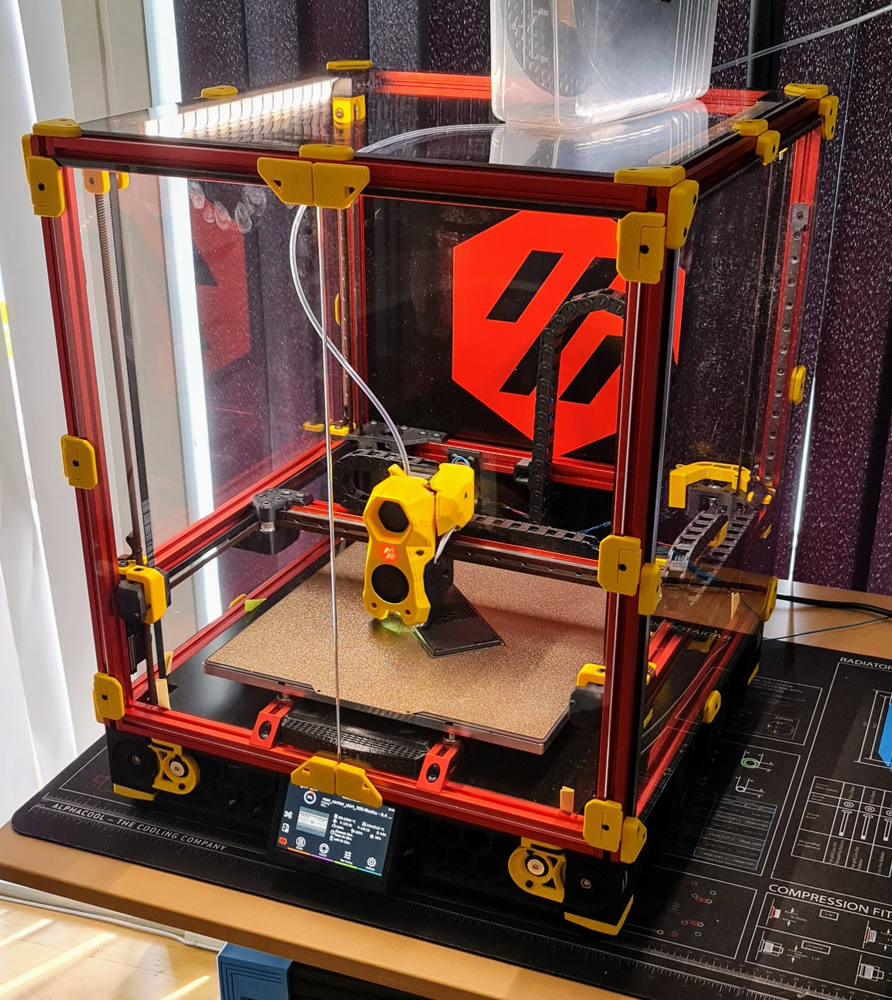

# Voron V2.xxxx - Mushu #

Config and settings for my [Voron V2.4](https://vorondesign.com/voron2.4) printer.

## Mods ## 

The printer is based on the LDO kit, and only have a few minor changes:

* [Dragon HF hotend](https://www.phaetus.com/phaetus-x-voron-hotend-hf/).
* [Waveshare 4.3 display](https://www.waveshare.com/4.3inch-hdmi-lcd-b.htm).
* [Waveshare mount](https://github.com/VoronDesign/VoronUsers/tree/master/printer_mods/jeoje/4.3_Inch_Touchscreen_Mount)

